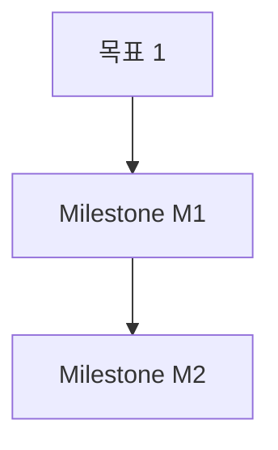

# AGI Charter — 프로젝트 초기 정체성 1회 정리

목표: 빈 Project Memory에 "이 프로젝트가 무엇인지" 한 번에 채운다.
**우리가 LLM 호출 안 함. 운전자 AI가 정리해서 9-field로 push한다.**

## 0. 컨텍스트 수집
사용자에게 다음을 묻거나 (이미 안다면 skip), 코드/문서에서 직접 확인:
- 프로젝트 한 줄 정체성 ("X를 위한 Y")
- 핵심 목표 1~3개
- 의도적 non-goal (안 할 것)
- 채택 결정 (기술 스택, 아키텍처, 방법론)
- 즉시 시작할 작업 (1차 milestone)
- 알려진 위험·제약
- 원칙·규칙
- 첨부할 도식/링크 (mermaid 가능)

`--from-file` 인자가 주어지면 그 파일을 읽어 위 정보 추출.

## 1. 9-field로 정리

매핑 가이드 (charter 작성 전용):

| 9-field | charter 매핑 |
|---|---|
| `RAW` | 사용자/문서에서 받은 원본 정체성 텍스트 |
| `SUMMARY` | 프로젝트 한 문장 정체성 |
| `DECISIONS` | 초기 채택 결정 (기술 스택, 아키텍처) + 원칙·규칙 |
| `TASKS` | 즉시 시작할 작업 (1차 milestone) |
| `RISKS` | 알려진 위험·제약 (`[low|medium|high]` severity 명시) |
| `DEPRECATED` | 의도적 non-goal (`→ replaced_by: <대안>` 형식) |
| `OPEN_QUESTIONS` | 아직 결정 못 한 것 |
| `ARTIFACTS` | 첨부 문서/도식/URL — mermaid 코드블록 가능 |
| `NEXT_CONTEXT` | 다음 AI 세션이 이어받을 핵심 한 줄 |

## 2. mermaid 도식 (선택)
필요하면 RAW 또는 ARTIFACTS 안에 mermaid 코드블록 포함:
````

````

## 3. 검토 후 push
- 정리된 9-field 블록을 사용자에게 먼저 보여주고 확인 받기.
- 사용자 OK 하면 임시 파일로 저장 후:
  ```
  python ~/.config/tsoft-agi/agi-upload.py --file <tmp> --source-tool <agent> --quiet
  ```
- `commit_id` 받으면 사용자에게 보고.
- AGI 라이브 링크 안내: `https://erp.t-soft.co.kr/projects/<project-id>/commits`
  → 거기서 사용자가 Merge 누르면 Project Memory 초기화 완료.

## 4. 응답 마지막 한 줄
```
ERP: pushed commit=<id>  (charter — 사용자가 AGI 페이지에서 Merge 필요)
```
